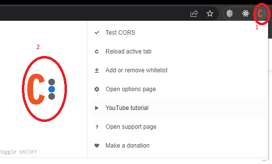
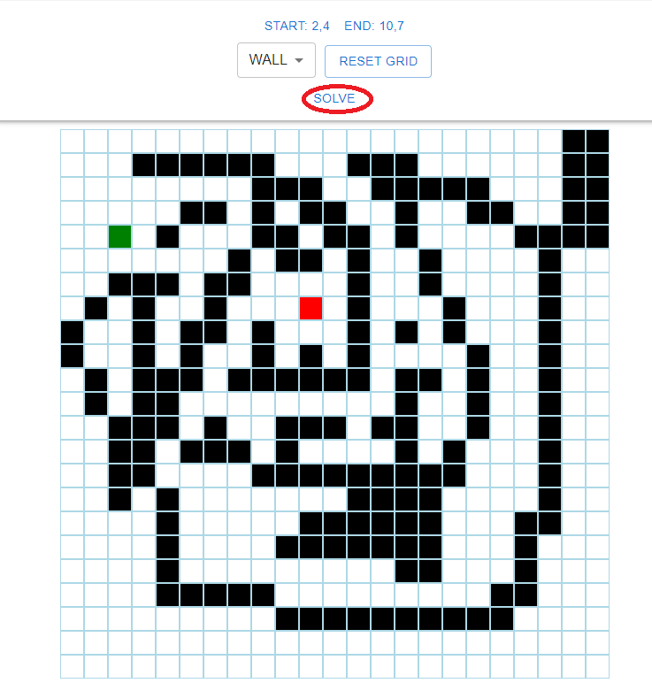
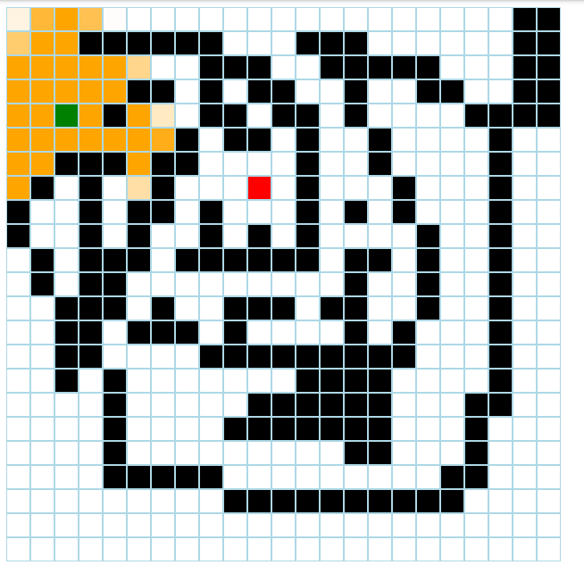
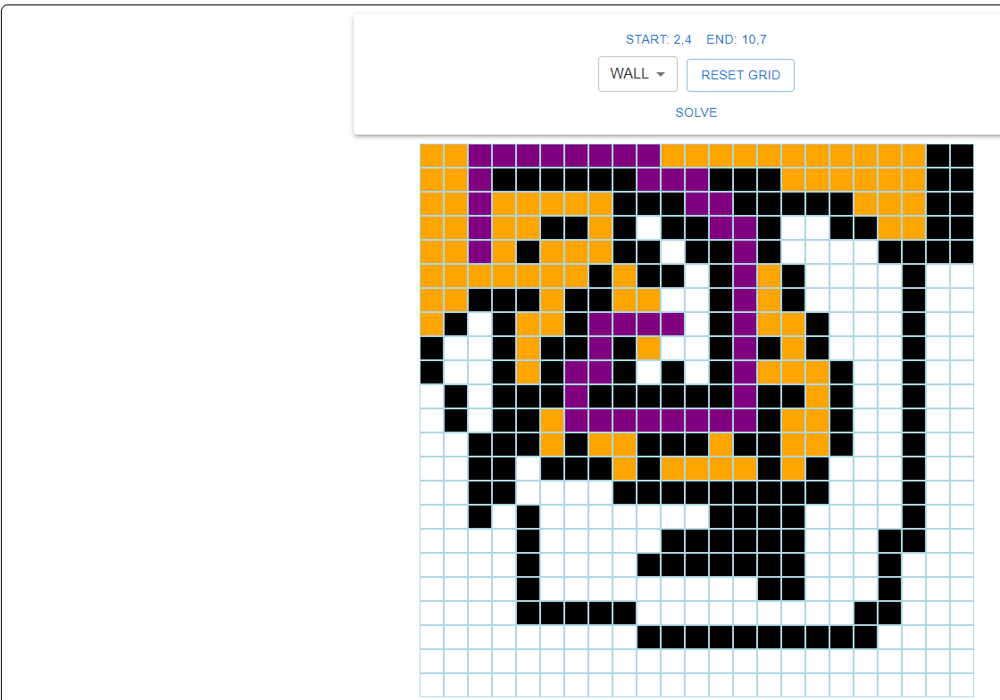

To run:
1. Cd into the "maze-js" directory and run command "npm install", which will install all the dependencies
2. Install the chrome cors extension (for Chrome): https://chrome.google.com/webstore/detail/allow-cors-access-control/lhobafahddgcelffkeicbaginigeejlf?hl=en
3. Enable extension  by clicking on its icon in chrome (1) and then clicking on the big "C" (2)
4. Start the python server
5. Run command "npm run" which will spin up the server or localhost:3000

Square colour coding:
START - green

EMPTY - white

WALL - black

VISITED - orange

PATH - purple

END - red

How to use:
1. Create a maze (must have a start and end point), walls are optional and click "SOLVE" 
2. Checked squares are returned from the python server as an SSE 
NOTE: Can only move horizontally/vertically (LEFT, RIGHT, UP and DOWN), not diagonally
3. Once the path is found it will be shown on the grid. 